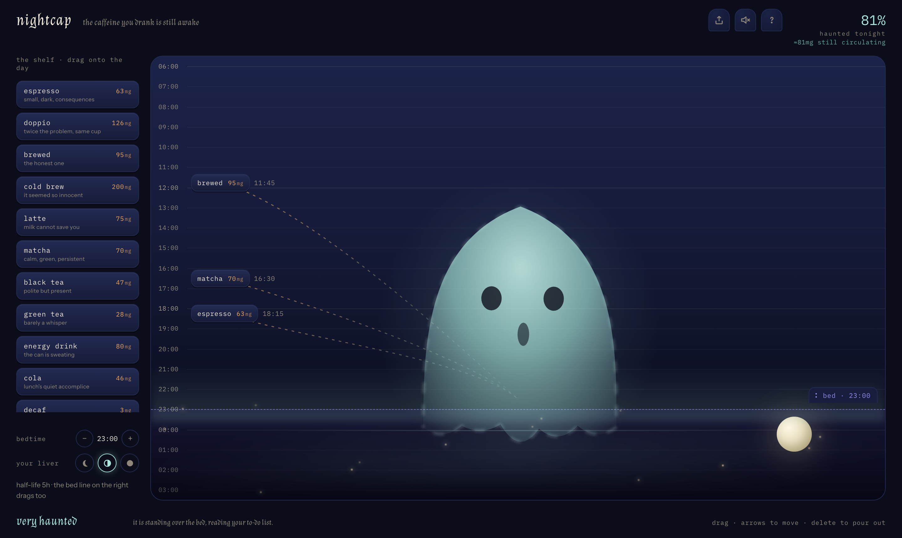
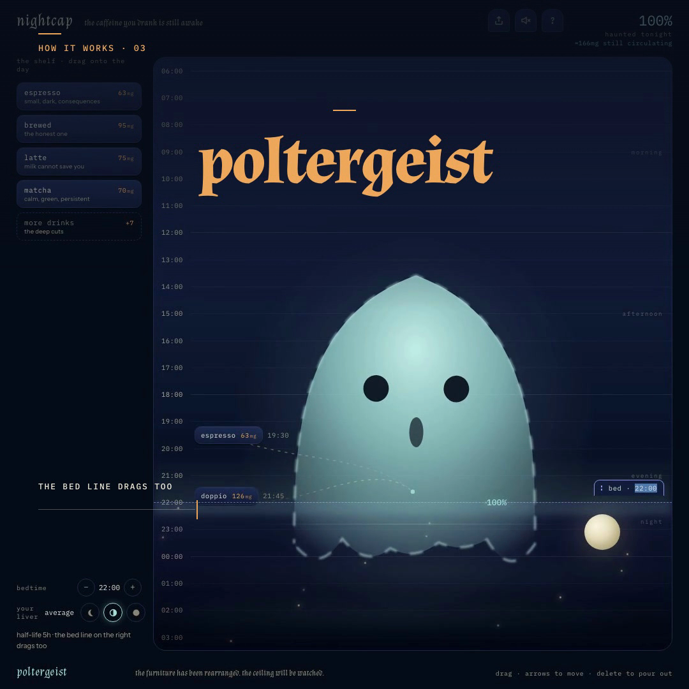

# nightcap

**the caffeine you drank is still awake.**

Drag your drinks onto the day; meet the ghost still awake at bedtime.



**[nightcap-ashy.vercel.app](https://nightcap-ashy.vercel.app)** — live, free, no account.

[](docs/launch.mp4)

*[launch film](docs/launch.mp4) — 29 seconds, the whole story.*

## What it is

nightcap is a small instrument for a question everyone asks too late:
*will tonight's coffee ruin tonight's sleep?*

Drag drinks from the shelf onto your day. A ghost materializes at your
bedtime line, sized and agitated by the caffeine still circulating when you
lie down. Drag a drink earlier and watch it thin. Drag the bed line and
watch it loom. The answer is a single number: how haunted tonight is,
in percent.

## How it works

- Each drink carries a caffeine dose. At bedtime, every dose is decayed
  with a half-life curve: `mg · 0.5^(hours since sip / half-life)`.
- Choose your liver: fast (3h), average (5h), or slow (9h) half-life.
- The residual milligrams become the haunted score, capped at 100:
  0% is a clear night, 100% is a poltergeist.
- Drinks dropped *after* bedtime are marked "too late" — they can't haunt
  tonight, though they still count toward the overdose verdict.
- The whole plan lives in the URL hash. Copy the link, share the exact
  haunting — drinks, bedtime, liver and all.
- Optional sound (off by default): a breath when the ghost condenses,
  a porcelain tap when a drink lands, a relieved sigh when it dissolves.
- Poured a drink out by mistake? A toast offers to put it back.
- On touch screens: tap a drink to arm it, then tap the day to place it.

## The ghost

The ghost is drawn fresh every frame in a single SVG, driven by a mutable
state object on `requestAnimationFrame` — no React re-renders, just
transforms and path math. It watches your cursor for a couple of seconds,
then politely looks away. It blinks. Past 55% haunted it grows a small,
worried mouth. Past 60% it leans over the bed line and narrows its eyes.
Past 400mg of total caffeine it starts to jitter.

## Keyboard

- `Tab` to a shelf chip, `Enter` to arm it, `↑`/`↓` to pick an hour, `Enter` to drop.
- `Tab` to a placed drink: `↑`/`↓` to move it 15 minutes, `Delete` to pour it out.
- `Tab` to the bed line: `↑`/`↓` to shift bedtime by 30 minutes.
- Everything is also a drag. The bed line is a drag too.

## Run it

```bash
npm install
npm run dev    # http://localhost:5173
npm run build  # static bundle in dist/
```

No backend, no tracking, no cost. Pure client-side math.

## Technical notes

- **Vite + React + TypeScript**, single page, state encoded in `location.hash`.
- **@use-gesture** is not used for the column — the drag loop is plain
  `pointermove`/`pointerup` on `window` so the cursor can leave the column
  and the preview still works.
- **number-flow** morphs the score digits; **torph** morphs the verdict text.
- **web-haptics** fires subtle haptics on drops and bedtime detents (where supported).
- `prefers-reduced-motion` calms the ghost's breathing, jitter, trails,
  fireflies and tray motion.
- Caffeine trails are drawn in real pixels against the measured column, so
  each thread actually lands on the ghost.
- The share card is drawn on a `<canvas>` in the product's own palette and
  exported as PNG — no image service involved.
- Google Fonts: Almendra (voice), Instrument Sans (UI),
  IBM Plex Mono (measurements).

## License

MIT. Built by [miguelgarglez](https://github.com/miguelgarglez).
